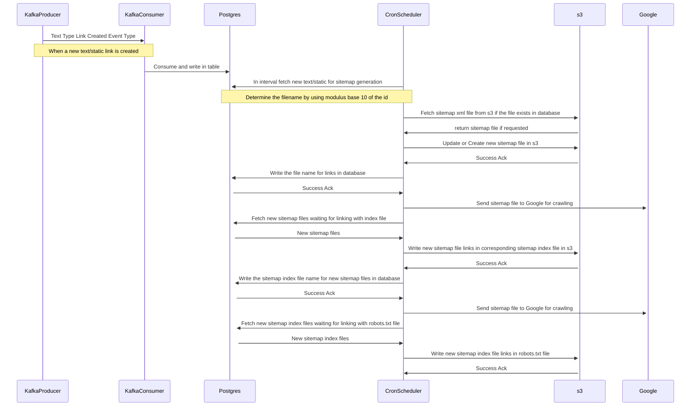

<p align="center">
  <a href="http://nestjs.com/" target="blank"></a>
</p>

# Description

Automated sitemap generator pipeline which automatically creates or amends sitemap files with new links and register them with popular crawlers like google.
<br/>
<br/>

## Technologies

1. [Apache Kafka](https://kafka.apache.org/): For real time updates of newly created links with relevant data
2. [PostgreSQL](https://www.postgresql.org/): For persistance, locking and mapping with sitemap files
3. [AWS S3](https://aws.amazon.com/s3/): For persisting actual sitemap xml files

## Dependencies

1. [NestJS](https://docs.nestjs.com/) : A progressive Node.js framework for building efficient and scalable server-side applications.
2. [Prisma.io](https://www.prisma.io/docs/getting-started) : Next-generation Node.js and TypeScript ORM
3. [kafkaJS](https://kafka.js.org/docs/getting-started) : Kafka client for nodeJS

# Getting Started

Create `.env` and override custom environment values

```bash
$ cat .env.example > .env
```

Install dependencies

```bash
$ npm install
```

Run DB Migrations

```bash
$ npx prisma migrate dev
```

## Running the app

```bash
# development
$ npm run start

# watch mode
$ npm run start:dev

# production mode
$ npm run start:prod
```

## Running the app via docker compose

The compose file provides:

1. Apache Kafka with Zookeeper and will automatically creating necessary topics
2. UI for kafka and will be accessible at port 8080
3. PostgreSQL 13 running on port 5432
4. UI for postgreSQL named Admirer which will be accessible at port 8081

```bash
docker compose -f docker-compose.yaml up -d
```

## Test

```bash
# unit tests
$ npm run test

# e2e tests
$ npm run test:e2e

# test coverage
$ npm run test:cov
```

<br/>

# How it works



# Scalability

Every new link is partitioned based on the id (Expected it to be bigint/int) by modulus base 10.
Hence each type of entity link creates 10 different sitemap files and follow naming convention as `text-sitemap-{modulusHashBase}-{modulusHashValue}-{fileIncrement}.xml` where modulusHashBase is 10 and modulusHashValue is `id % 10` and fileIncrement is the number of files created for that type of entity which basically increment after every `50000` links which is the limit of urls you can have in a sitemap file. <br>
Sitemap Index files also follow the same logic for partitioning and the file increment happens after `20000` sitemap urls in a sitemap index file.
So in theory the service can be scaled for parallel processing of 10 individual processes. And the service is written in a way to handle the case where we want multiple nodes running for same modulusHashValue for more reliability. Crons lock the files via table locks so that no other processes is accessing the file at the same time.

## License

Repository is [GNU licensed](LICENSE).
